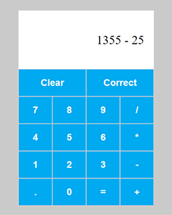

# Calculadora - React.js
**Live preview:** [clique aqui para acessar](https://lcarrati.github.io/trilha-react-desafio01-calculadora/)

Calculadora é desenvolvida com React.js e styled-components para criar uma interface funcional e responsiva. 
Com a utilização de React Hooks, como useEffect, useContext e useReducer, juntamente com o poder do Contexto Global, esta calculadora oferece uma experiência de usuário fluida e responsiva.

## Recursos Destacados:
- **CSS in JS:** O Styled Components permite escrever estilos CSS dentro do JavaScript, melhorando a arquitetura e a manutenção do código.
- **Responsividade:** A interface se adapta para funcionar perfeitamente em dispositivos móveis, tablets e desktops, garantindo uma experiência consistente em qualquer tela.
- **React Hooks:** O uso dos hooks useEffect, useContext e useReducer para um desenvolvimento mais eficiente e organizado.
- **UX/UI:** O usuário podem clicar nos botões na tela ou usar o teclado para inserir números e operadores, proporcionando flexibilidade na entrada de dados.
- **Contexto Global:** A lógica do display da calculadora é gerenciada com o uso do React Context API, tornando a aplicação mais escalável e fácil de manter.
- **Lógica Personalizada:** Todas as operações matemáticas foram desenvolvidas a partir do zero, sem depender de bibliotecas prontas.

## Objetivo:
Meu objetivo com este projeto era criar uma calculadora moderna e funcional utilizando React.js, sendo uma releitura da calculadora que desenvolvi em Javascript.

## Experimente a calculadora!
[Clique aqui para acessar](https://lcarrati.github.io/trilha-react-desafio01-calculadora/)

&nbsp;
